# Official client implementation

Once you install official Peercoin client from peercoin.net, you’ll have access to three executables: peercoind, peercoin-qt, and peercoin-cli.

## Peercoin Wallet

`peercoin-qt` provides a combination full Peercoin network client and wallet. Peercoin-qt is highly portable application written in QT5 framework.
From the Help menu, you can access a console where you can enter the RPC commands so power-user features are still available.

## peercoind

`peercoind` provides a full peer which you can interact with through JSON-RPC interface on port 9904 (902 for testnet).

For more information on how to use the JSON-RPC interface see the [json-rcp-api-reference article](./006-json-rpc-api-reference.md)

## peercoin-cli

`peercoin-cli` allows you to send JSON-RPC commands to running instance of `peercoind` from the command line.
For example:
> peercoin-cli help

> peercoin-cli getinfo

All three programs get settings from peercoin.conf in the Peercoin application directory:

> Windows: %APPDATA%\Peercoin\

> OSX: $HOME/Library/Application Support/PPCoin/

>Linux: $HOME/.peercoin/

To use `peercoind` and `peercoin-cli`, you will need to add a RPC password to your peercoin.conf file. Both programs will read from the same file if both run on the same system as the same user, so any long random password will work:

> rpcpassword=change_this_to_a_long_random_password

You should also make the peercoin.conf file only readable to its owner.
On Linux, Mac OSX, and other Unix-like systems, this can be accomplished by running the following command in the Peercoin application directory:

> chmod 0600 peercoin.conf

# Peercoin Core Wallet

## Overview

### Windows Installation

To install on Windows, you can find the download files here: https://peercoin.net/download.  Once download is complete, extract the contents of the folder.  Depending on if your system is x32 or x64 bits, choosing the relevant folder.  Run the peercoin-win_setup.exe and you will be guided through the installation process.  Once finishes, the client can be launched by running "peercoin-qt.exe" from the appropriate folder.

### Debian Installation

As of April 2018, Peercoin has official Debian repository hosted at `repo.peercoin.net`.
Repository is serving .deb packages for latest Debian stable, for amd64 and armhf hardware architectures.
Repository offers two packages, `peercoin-qt` which is official graphical client for the Peercoin network and `peercoind` which is a daemon client for the network.
In the future repository may host other Peercoin-related packages.

### Mac Installation

To install for MacOS, you can find the download files here: https://peercoin.net/download.  Once the download is complete, extract the contents of the folder.  Inside the extracted folder, double click the "Peercoin-Qt.dmg" file to open the client.

#### Adding the GPG key

`wget -O - https://repo.peercoin.net/peercoin.gpg.key | sudo apt-key add -`

#### Adding the repository in the sources

`sudo sh -c "echo 'deb http://repo.peercoin.net stretch main' >> /etc/apt/sources.list.d/peercoin.list"`

`sudo apt update`

#### Installing the packages

`sudo apt install peercoin-qt`

### Debian/Ubuntu Package Compilation Guide

If you want a more in-depth guide on the compilation of the client for a variety of systems, [more can be found here](004-compiling-packages-for-debian.md)
____________

## General Notes

### Wallet Encryption

When a wallet is first generated, it will be unencrypted.  In order to encryt the wallet, one must go to Settings > Encrypt Wallet.  The client will then prompt the user for a password which will then be used to verify transactions and unlock the wallet for minting in the future.  It is important to make sure this password is remembered as losing access means losing access to any coins held in that wallet.  A wallet must be encrypted in order to participate in minting.

### Backups

It is strongly recommended that a backup of the wallet.dat is made and kept in a separate location in the event of hardware failure or similar disaster.  Choosing File > Backup Wallet, will present the user with the option of where to export this file.

____________

## Wallet Overview

From this tab you can see the "Available", "Pending", and "Total" balance of your Peercoin wallet.  On the right side, you can see your "Recent transactions" as well which will show the most recent transactions that have come into the wallet recently.

### Send

The send tab is used to send Peercoin.  The "Pay To" section is where a target address can be entered.  If you wish to label the address for future use, such as an exchange, you may add it to your address book.  Amount determines the quantity of Peercoin which will be sent in the transaction.  If the wallet is encrypted, the secure password must be entered before the send transaction can be finalized.

### Receive

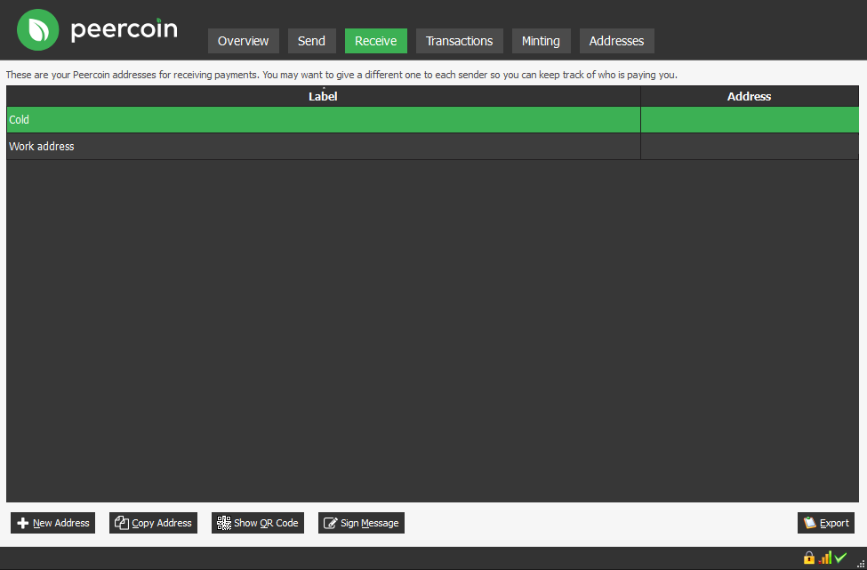

The Receive tab lists all wallet addresses attached to the Peercoin client.  Generating a new address is as simple as clicking the "New Address" button at the bottom of the screen.  The "Sign Message" button can also be used to verify ownership of a wallet.  [There is a tutorial on signing messages with the Peercoin client here.](014-SigningMessages.md)  The example addresses have been removed from the image for privacy sake.

### Transactions

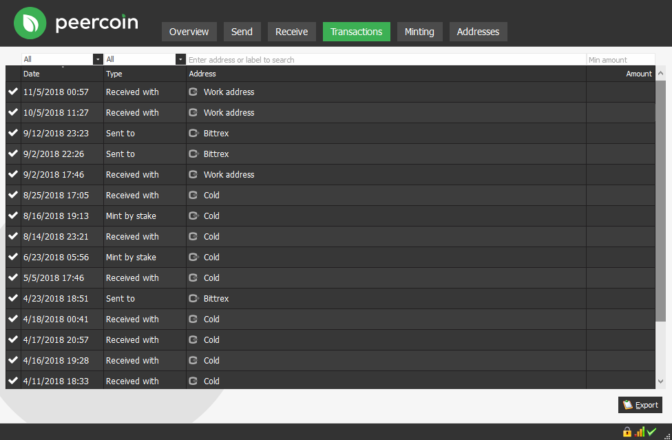

The Transactions tab gives a full history of recent transactions that have come in and out of the wallet since its creation.  It will list the Date, Type, Address, and Amount.  This information can be exported as a .csv using the "Export" button on the bottom right of the screen.  The amounts have been removed from the image for privacy sake.

### Minting

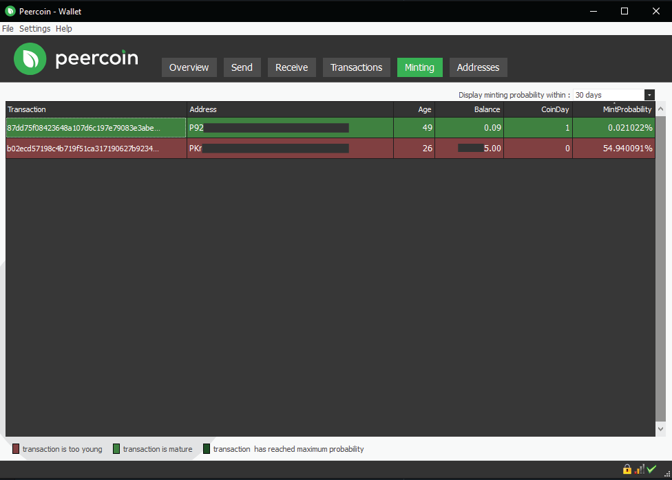

The Minting tab is the fifth option and from here, you can see the coin age of your transaction.  The Address, Age, Balance, CoinDay, and MintProbability, are also displayed.  Until the transaction reaches 30 days of age, it will be displayed in red, with a CoinDay of 0.  In the picture above, you can see a transaction that is red and is not eligible for staking due to it only having a an Age of 49.  In the next 30 days, it has a probability of minting of roughly 54.94%.  In 4 days, that transaction will become eligible for minting and change to green color.  You can use the "Display minting probability within:" drop-down menu to estimate the probability of minting during the next period.  Once the 30 day period has passed, and the transaction has become eligible for minting, go to Settings > Decrypt Wallet for Minting Only, and enter your wallet password.  If you have not already encrypted your wallet, you will be asked to do so.  Once the wallet has been unlocked for minting, leaving it running will allow for minting to occur.  Making a transaction from that wallet will disrupt the coin age and the maturation process will have to be repeated.  Sending more coins will not disrupt the coin age.

If you are interested in calculating the rough time until minting takes place, you can use this calculator: http://poscalculator.peercointalk.org/

Once minting occurs, the initial batch of coins will have their coin age reset, and the coins earned from minting will remain locked for 520 blocks, or roughly 3 days.  After this period, the coins will be available in the wallet.  As a note, you do not need to leave your wallet running 24/7, as the time spent staking does not increase the probability of minting taking place, as the highest coin age will always take precedence.  Holding longer also does not increase the minting reward.

### Addresses

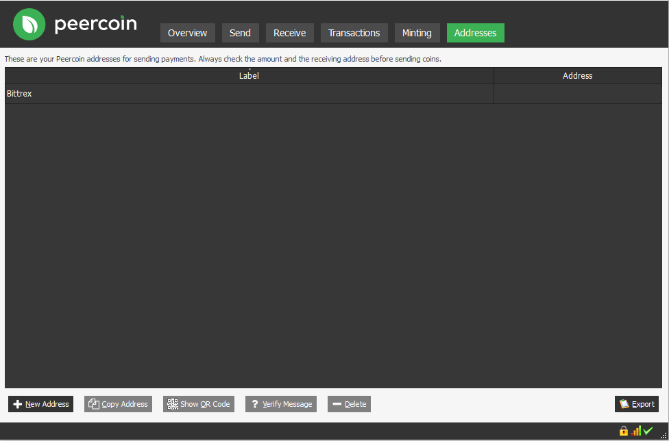

Addresses is the final tab and displays the addresses saved to the Address Book from the Send tab.  This is handy for managing repeat use addresses such as exchanges.  The example address has been removed from the image for privacy sake.

____________

## Creating a New Address

Creating a new address is very simple.  Navigate to the "Receive" tab and select the "New Address" button.  A window with a "Label" and "Address" field will appear.  Enter the name you want in the "Label" field.  You will be able to change this later.  Leave the "Address" field blank.  Click "Ok" to continue.  If you have already encrypted your wallet, you will need to enter your wallet password.

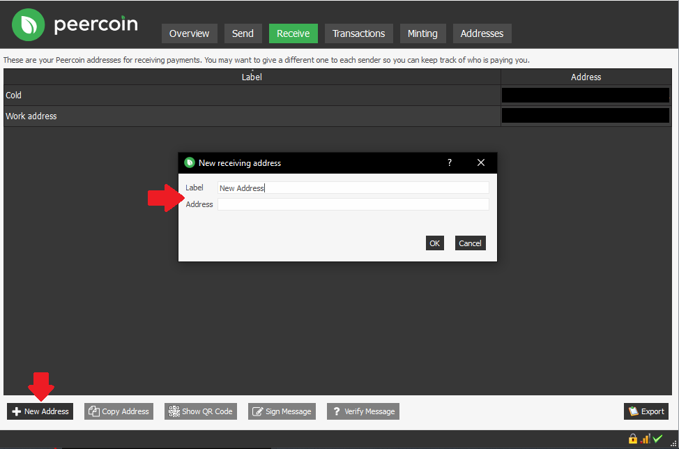

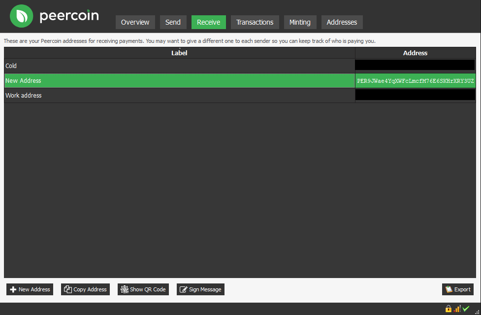

You can see the new address now available.  If you want to change the name of the label of the address, double click the name and you will be able to enter a new one.

_________________________________________

## Sending Peercoin

If you want to send Peercoin, navigate to the "Send" tab.  We are going to send some Peercoins to the address we created above.  This page has three fields: "Pay To", "Label", and "Amount".  Paste the address you want to send Peercoins to into the "Pay To" field.  Make sure to verify that this address is correct.  If you already have a label for this wallet, it will automatically fill in the "Label" field.  If not, you can write your own in and it will be saved in your address book (Under the "Address" tab).  In the amount field, insert the number of Peercoins you would like to send.  There is a drop down menu which allows you to determine if you want to send in denominations of "Peercoins", "MilliPeercoins", "MicroPeercoins".  Make sure that you have enough to pay for the transaction fee.  When everything is finalized, press the "Send" button to confirm the transaction.  You will be prompted to confirm the transaction and must enter your wallet password to verify the transaction.  Once this is completed, you can view the transaction under the "Transactions" tab.

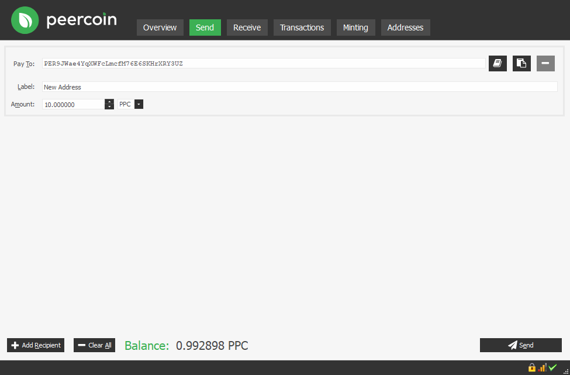

_________________________________________

# Using the multisig

You can access multisig graphic interface in latest builds of Peercoin-qt. Open Peercoin-qt, click on File - Multisig. Now you see Multisig interface.

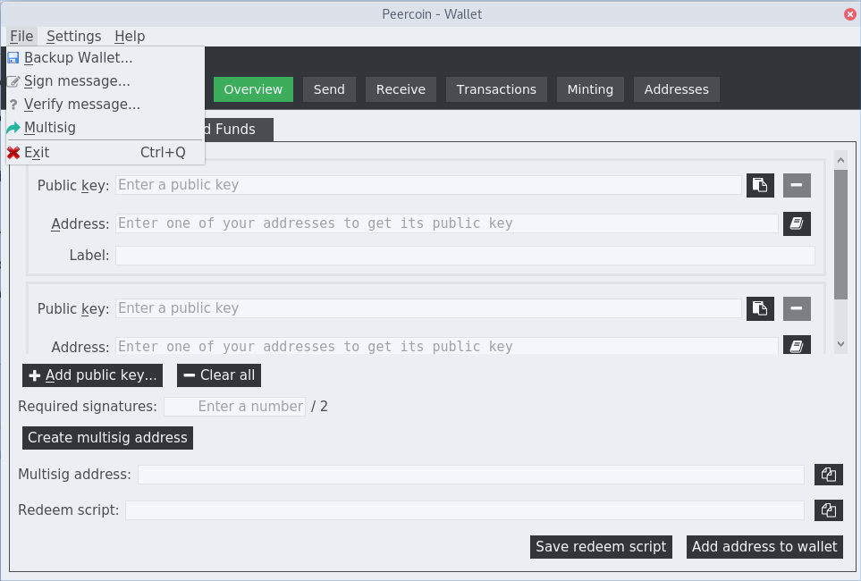

## How to create a multisig address using QT wallet

In this example, we'll go over creating 2/3 multisig address.
On your screen you see two tables, each containing "Public key", "Address" and "Label".

1) First click "+ Add public key" button, this will make three input fields. Then enter number 2 in the "Required signatures" field.

2) In the first table, we will first make input in "Address field". You can click book-like icon on the right side to load address from your address book. When you do so, other fields will be auto-populated.

3) Your partners will need to do the same and copy their entries to you. When you exchange information properly make final check to reduce chance of error and finally click on "Create multisig address" button.

4) Now multisig address is created, confirm that all of you got the same address.

5) Finally click "Add address to wallet" in lower right to have it listed in your address book.

That is it, now you have your 2/3 multisig address.

## Creating a multisig address using the command line interface (debug console)

The multisig address is generated with the complete public keys of the participants.

**Alice:**

validateaddress "mw2pj33HMhRfRkKtceHcyKpPiGYkPdD4SM"

    {
      "isvalid" : true,
      "address" : "mw2pj33HMhRfRkKtceHcyKpPiGYkPdD4SM",
      "ismine" : true,
      "isscript" : false,
      "pubkey" : "02c16ff447129fae7374d97212cf9fcd88a744da87ff2985869065cd6d17ee5c0b",
      "iscompressed" : true,
      "account" : "Alice"
    }

**Bob:**

validateaddress "mkLNecFNeiJgKjw6492nqDiQfKQs1JnLmE"

     {
       "isvalid" : true,
       "address" : "mkLNecFNeiJgKjw6492nqDiQfKQs1JnLmE",
       "ismine" : true,
       "pubkey" : "025cc4b319284aabcdaef6e9a18af0bb73ac5d4b9f2556a214f30686b0173b316e",
       "iscompressed" : true,
       "account" : "Bob"
     }

**Charlie:**

validateaddress "mm8Fwn92RU8zvJmH7TCpaYL3v4PTyjN4xd"

    {
      "isvalid" : true,
      "address" : "mm8Fwn92RU8zvJmH7TCpaYL3v4PTyjN4xd",
      "ismine" : true,
      "isscript" : false,
      "pubkey" : "033ba42c942ff7e7fcf42ff604d6ef6c51826f9eea3a04308379c2ade98fb9e703",
      "iscompressed" : true,
      "account" : "Trent"
    }

createmultisig 2 '["02c16ff447129fae7374d97212cf9fcd88a744da87ff2985869065cd6d17ee5c0b", "025cc4b319284aabcdaef6e9a18af0bb73ac5d4b9f2556a214f30686b0173b316e", "033ba42c942ff7e7fcf42ff604d6ef6c51826f9eea3a04308379c2ade98fb9e703"]'

    {
      "address" : "2N582fRZZZm9hL4RH4sguG9SDDLZhu7eeng",
      "redeemScript" : "522102c16ff447129fae7374d97212cf9fcd88a744da87ff2985869065cd6d17ee5c0b21025cc4b319284aabcdaef6e9a18af0bb73ac5d4b9f2556a214f30686b0173b316e21033ba42c942ff7e7fcf42ff604d6ef6c51826f9eea3a04308379c2ade98fb9e70353ae"
    }

_________________________________________

## How to spend from the multisig address

Reference Peercoin client is not capable of indexing the multisig addresses and showing their balance because multisig addresses can be owned by keys which are not part of the wallet (friends, family, backup). Thus the procedure to spend the funds from the multisig is a bit more complicated, more "low level" then usual.

In the "Spend Funds" tab of the multisig dialog, on the left there is "Inputs" table. You need to provide with the [UTXO](https://en.wikipedia.org/wiki/Unspent_transaction_output) you want to spend. That is, the `txid` and output index. On the right side there is "Outputs" table, where the desired outputs will be placed. Please note that you have to include the change output and deduct the tx fee (0.01 PPC per kB).

After that is set, click on the "Create Transaction" button bellow, and copy the resulting hash to your peers for further signing.
Finally paste the hash of fully signed raw transaction into "Sign Transaction" box bellow and click send.

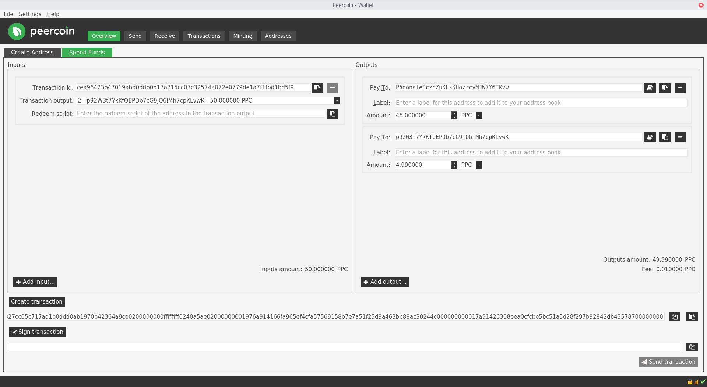

### Spending from the multisig via command line interface

Bob creates a transaction to spend the coins that Alice sent to the multisig address.
The transaction will have 360 PPC (Alice's coins) as input and 359.99 PPC as output (because of the mandatory 0.01 PPC transaction fee; the transaction won't be accepted by the network without it).

**Bob:**

getrawtransaction "0ef16552d0dadaa150da34cfbc5380e82d59b5f328f967fb72104c43a1b99f74" 1

    {
      "hex" : "01000000197f5a530105a302fe97c3ab33581486fdb39296e8728d2dac7b06324a62ab83515c30d9d8000000006b4830450221008054ee73403f401b2c10acdaed1e51e5345d35fb24574719d8a01203934c6e3202204d97e79ccdae05713b18d85e36896e3bd7a1a0636bd207a493779ca6a7c148c4012102c16ff447129fae7374d97212cf9fcd88a744da87ff2985869065cd6d17ee5c0bffffffff02f0591b2c000000001976a9149f99f0ec7288694065243d32bea766bf9a8d602188ac002a75150000000017a914824524d69e3c8f2ea66e39af89727bc0e8d3de4b8700000000",
      "txid" : "0ef16552d0dadaa150da34cfbc5380e82d59b5f328f967fb72104c43a1b99f74",
      "version" : 1,
      "locktime" : 0,
      "vin" : [
        {
          "txid" : "d8d9305c5183ab624a32067bac2d8d72e89692b3fd86145833abc397fe02a305",
          "vout" : 0,
          "scriptSig" : {
            "asm" : "30450221008054ee73403f401b2c10acdaed1e51e5345d35fb24574719d8a01203934c6e3202204d97e79ccdae05713b18d85e36896e3bd7a1a0636bd207a493779ca6a7c148c401 02c16ff447129fae7374d97212cf9fcd88a744da87ff2985869065cd6d17ee5c0b",
            "hex" : "4830450221008054ee73403f401b2c10acdaed1e51e5345d35fb24574719d8a01203934c6e3202204d97e79ccdae05713b18d85e36896e3bd7a1a0636bd207a493779ca6a7c148c4012102c16ff447129fae7374d97212cf9fcd88a744da87ff2985869065cd6d17ee5c0b"
          },
          "sequence" : 4294967295
        }
      ],
      "vout" : [
        {
          "value" : 739.99000000,
          "n" : 0,
          "scriptPubKey" : {
            "asm" : "OP_DUP OP_HASH160 9f99f0ec7288694065243d32bea766bf9a8d6021 OP_EQUALVERIFY OP_CHECKSIG",
            "hex" : "76a9149f99f0ec7288694065243d32bea766bf9a8d602188ac",
            "reqSigs" : 1,
            "type" : "pubkeyhash",
            "addresses" : [
              "mv4r9a4FXuDgSA5GaFtLGC9W5Db3XJUrLD"
            ]
          }
        },
        {
          "value" : 360.00000000,
          "n" : 1,
          "scriptPubKey" : {
            "asm" : "OP_HASH160 824524d69e3c8f2ea66e39af89727bc0e8d3de4b OP_EQUAL",
            "hex" : "a914824524d69e3c8f2ea66e39af89727bc0e8d3de4b87",
            "reqSigs" : 1,
            "type" : "scripthash",
            "addresses" : [
              "2N582fRZZZm9hL4RH4sguG9SDDLZhu7eeng"
            ]
          }
        }
      ],
      "blockhash" : "05a7088c02f589ca91beb52ea9667955f7ee10a2433e56f2e11a058c2273bb70",
      "confirmations" : 2,
      "time" : 1398439709,
      "blocktime" : 1398439709
    }

createrawtransaction '[{"txid" : "0ef16552d0dadaa150da34cfbc5380e82d59b5f328f967fb72104c43a1b99f74", "vout" : 1, "scriptPubKey" : "a914824524d69e3c8f2ea66e39af89727bc0e8d3de4b87", "redeemScript" : "522102c16ff447129fae7374d97212cf9fcd88a744da87ff2985869065cd6d17ee5c0b21025cc4b319284aabcdaef6e9a18af0bb73ac5d4b9f2556a214f30686b0173b316e21033ba42c942ff7e7fcf42ff604d6ef6c51826f9eea3a04308379c2ade98fb9e70353ae"}]' '{"mub5ke5cWP4nZW2VDgtAkFGA7UzSVhwese" : 359.99}'

    0100000062815a5301749fb9a1434c1072fb67f928f3b5592de88053bccf34da50a1dadad05265f10e0100000000ffffffff01f0027515000000001976a9149a59a69866c7668acdd2b36491cfc18229d2348988ac00000000

#### First signature of the transaction

Bob signs the new transaction with the private key associated to the public key he used to create the multisig address and sends the result to Alice.

**Bob:**

dumpprivkey "mkLNecFNeiJgKjw6492nqDiQfKQs1JnLmE"

    cTxxxxxxxxxxxxxxxxxxxxxxxxxxxxxxxxxxxxxxxxxxxxxxxxo5

signrawtransaction "0100000062815a5301749fb9a1434c1072fb67f928f3b5592de88053bccf34da50a1dadad05265f10e0100000000ffffffff01f0027515000000001976a9149a59a69866c7668acdd2b36491cfc18229d2348988ac00000000" '[{"txid" : "0ef16552d0dadaa150da34cfbc5380e82d59b5f328f967fb72104c43a1b99f74", "vout" : 1, "scriptPubKey" : "a914824524d69e3c8f2ea66e39af89727bc0e8d3de4b87", "redeemScript" : "522102c16ff447129fae7374d97212cf9fcd88a744da87ff2985869065cd6d17ee5c0b21025cc4b319284aabcdaef6e9a18af0bb73ac5d4b9f2556a214f30686b0173b316e21033ba42c942ff7e7fcf42ff604d6ef6c51826f9eea3a04308379c2ade98fb9e70353ae"}]' '["cTxxxxxxxxxxxxxxxxxxxxxxxxxxxxxxxxxxxxxxxxxxxxxxxxo5"]'

    {
      "hex" : "0100000062815a5301749fb9a1434c1072fb67f928f3b5592de88053bccf34da50a1dadad05265f10e01000000b40047304402201dfd957507d6b48b777a6f5c31d85fb8d00513b79c55dbd902c7f6dee90bc4cc0220773f05b481a9dbbc3153cb832acd994caef0d569de49d3b4a125b5f1e637836c014c69522102c16ff447129fae7374d97212cf9fcd88a744da87ff2985869065cd6d17ee5c0b21025cc4b319284aabcdaef6e9a18af0bb73ac5d4b9f2556a214f30686b0173b316e21033ba42c942ff7e7fcf42ff604d6ef6c51826f9eea3a04308379c2ade98fb9e70353aeffffffff01f0027515000000001976a9149a59a69866c7668acdd2b36491cfc18229d2348988ac00000000",
      "complete" : false
    }

#### Second signature of the transaction

Let's imagine that Alice refuses to sign the transaction.
Bob sends the transaction with one signature to Trent and asks him to validate it. Let's imagine that Trent decides that the transaction is legitimate.
Trent signs the transaction with the private key associated to the public key he used to create the multisig address.

**Charlie:**

dumpprivkey "mm8Fwn92RU8zvJmH7TCpaYL3v4PTyjN4xd"

    cPxxxxxxxxxxxxxxxxxxxxxxxxxxxxxxxxxxxxxxxxxxxxxxxxis

signrawtransaction "0100000062815a5301749fb9a1434c1072fb67f928f3b5592de88053bccf34da50a1dadad05265f10e01000000b40047304402201dfd957507d6b48b777a6f5c31d85fb8d00513b79c55dbd902c7f6dee90bc4cc0220773f05b481a9dbbc3153cb832acd994caef0d569de49d3b4a125b5f1e637836c014c69522102c16ff447129fae7374d97212cf9fcd88a744da87ff2985869065cd6d17ee5c0b21025cc4b319284aabcdaef6e9a18af0bb73ac5d4b9f2556a214f30686b0173b316e21033ba42c942ff7e7fcf42ff604d6ef6c51826f9eea3a04308379c2ade98fb9e70353aeffffffff01f0027515000000001976a9149a59a69866c7668acdd2b36491cfc18229d2348988ac00000000" '[{"txid" : "0ef16552d0dadaa150da34cfbc5380e82d59b5f328f967fb72104c43a1b99f74", "vout" : 1, "scriptPubKey" : "a914824524d69e3c8f2ea66e39af89727bc0e8d3de4b87", "redeemScript" : "522102c16ff447129fae7374d97212cf9fcd88a744da87ff2985869065cd6d17ee5c0b21025cc4b319284aabcdaef6e9a18af0bb73ac5d4b9f2556a214f30686b0173b316e21033ba42c942ff7e7fcf42ff604d6ef6c51826f9eea3a04308379c2ade98fb9e70353ae"}]' '["cPxxxxxxxxxxxxxxxxxxxxxxxxxxxxxxxxxxxxxxxxxxxxxxxxis"]'

    {
      "hex" : "0100000062815a5301749fb9a1434c1072fb67f928f3b5592de88053bccf34da50a1dadad05265f10e01000000fdfd000047304402201dfd957507d6b48b777a6f5c31d85fb8d00513b79c55dbd902c7f6dee90bc4cc0220773f05b481a9dbbc3153cb832acd994caef0d569de49d3b4a125b5f1e637836c014830450220576a38baba9c821a5dbfce6be50825322995041a052f8a76016928ee2741b542022100e95dcefd049628e8c422ee584eb1c3feab3d00f7111a29a16f40353ff7de9648014c69522102c16ff447129fae7374d97212cf9fcd88a744da87ff2985869065cd6d17ee5c0b21025cc4b319284aabcdaef6e9a18af0bb73ac5d4b9f2556a214f30686b0173b316e21033ba42c942ff7e7fcf42ff604d6ef6c51826f9eea3a04308379c2ade98fb9e70353aeffffffff01f0027515000000001976a9149a59a69866c7668acdd2b36491cfc18229d2348988ac00000000",
      "complete" : true
    }

#### Send the signed transaction to the network

The transaction has the two required signatures, anyone can send it to the network.

sendrawtransaction "0100000062815a5301749fb9a1434c1072fb67f928f3b5592de88053bccf34da50a1dadad05265f10e01000000fdfd000047304402201dfd957507d6b48b777a6f5c31d85fb8d00513b79c55dbd902c7f6dee90bc4cc0220773f05b481a9dbbc3153cb832acd994caef0d569de49d3b4a125b5f1e637836c014830450220576a38baba9c821a5dbfce6be50825322995041a052f8a76016928ee2741b542022100e95dcefd049628e8c422ee584eb1c3feab3d00f7111a29a16f40353ff7de9648014c69522102c16ff447129fae7374d97212cf9fcd88a744da87ff2985869065cd6d17ee5c0b21025cc4b319284aabcdaef6e9a18af0bb73ac5d4b9f2556a214f30686b0173b316e21033ba42c942ff7e7fcf42ff604d6ef6c51826f9eea3a04308379c2ade98fb9e70353aeffffffff01f0027515000000001976a9149a59a69866c7668acdd2b36491cfc18229d2348988ac00000000"

    fea9875ccac102897ff128c868027a05e3d2f9057569529c8e5e94f8d641bc47

# How To Sign a Message Using the Peercoin Client

First, check that the address you want to use is loaded up into the wallet of your Peercoin client.  You can use the standard client found [here](https://peercoin.net/download).  The list of your addresses can be found using the receive tab.

Once you are satisfied that the address is in the wallet (you can even copy it to your clipboard if you like), open up the 'Sign message...' option of the 'File' menu.

At this point, you should be on the 'Sign Message' tab where you can paste in the address you want to use, either via your clipboard or by clicking on the address book button.

Now you can type your message into the big blank box.  It might be best to copy and paste this text from a plaintext source in order to avoid any formatting issues.  When you are done, hit the 'Sign Message' button.

If it completed its function correctly, it will display in green 'Messaged signed.'  Copy the signature using the convenient button.

Just to be sure everything worked correctly, you can validate your signature.  Go to the 'Verify Message' tab and fill in all the fields.  If everything looks good, and it comes back with a green 'Message verified.' then you can share with anyone your signature, message, and address and they should be able to verify it just the same.

Congratulations, you have now cryptographically signed and verified a message!

# Hardware Wallets

## Stakebox

Stakebox is a project by Peercoin Foundation and PiSupply to deliver cost and power efficient, user friendly set-top box able to run a blockchain node.
Stakebox is a plug and play Pi with the Peercoin wallet pre-installed.What is need is a keyboard and monitor to plug in to and you are ready to go.

*StakeBox is a brand by Pi Supply, which is a world leading distributor of Raspberry Pi mini computers.*

### Installation

Beside ordering a pre-installed Stakebox from [PiSupply website](https://www.stakebox.org/products/peercoin-stakebox) you can also make one yourself.

What do you need:

* Raspberry Pi (2 or newer)
* image downloaded from files.peercoin.net
* an SD card (4GB +)
* some spare time

Download the image from files.peercoin.net, use the [Etcher](http://etcher.io/) to load it to the SD card.

Now follow the guide: https://www.stakebox.org/blogs/learn/getting-started-with-peercoin-stakebox.

## Ledger Peercoin Tutorial

### Ledger Live

If you wish to store Peercoin on the Ledger Nano or Ledger Blue, this tutorial will guide you through using the Ledger Live program

Open the Ledger Live program and enter your password to unlock the wallet.  In order to store Peercoin, we first need to add the Peercoin wallet application to the Ledger device.  If this is the first time you are using a Ledger device, you will have to install the Bitcoin app first.  Follow the same steps to add the Bitcoin app, then do the same process for the Peercoin application.  Select Manager from the sidebar and make sure your device is connected, unlocked, and allows access when prompted by the Ledger Manager.

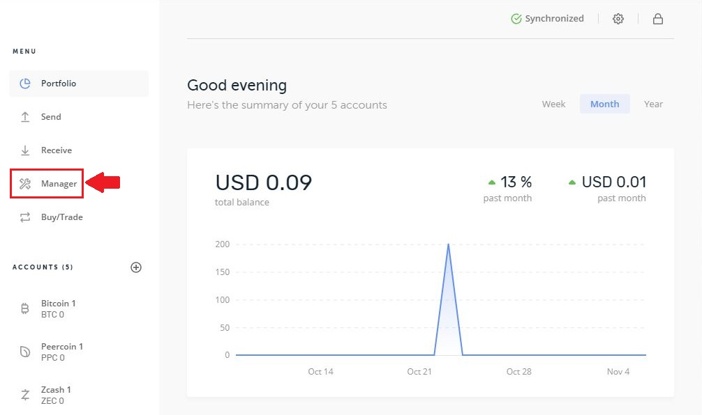

Once this is done, you will be presented with a variety of apps that can be added.  Type in "Peercoin" to find the Peercoin app.  Click the "Install" button and you will be asked to confirm this on your Ledger device.  After a moment, the app will be done installing.  Click "Okay" to proceed.

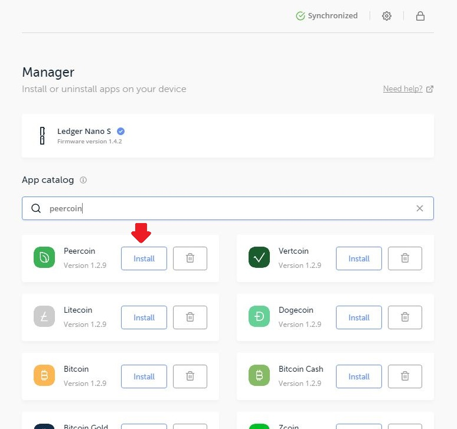

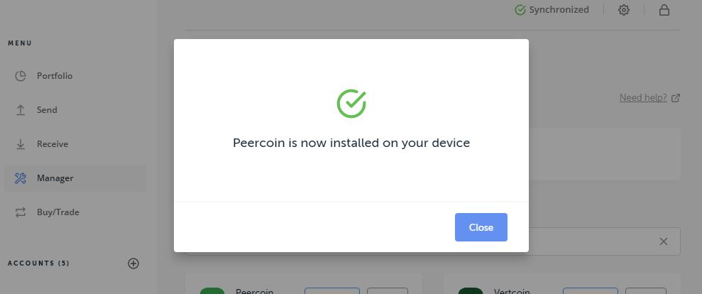

Once this is finished, the Peercoin app is now installed on your Ledger device.  Now we need to add an actual wallet account which we can do by clicking "Portfolio" to return to our starting screen.  Once you are on the main screen, click the "+" by the Accounts tab to add a new asset.

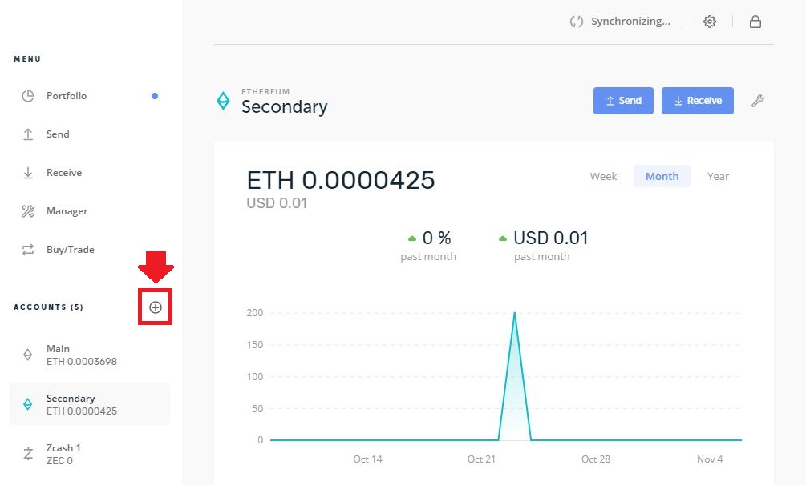

This will open the menu where you can search for the asset account you would like to add.  Input "Peercoin" and click continue.  You will have to unlock your Ledger again and navigate to the Peercoin app.  To open it, press both buttons on the Ledger Nano device simultaneously.  Once this is done, Ledger Live will sync and you will have the option to name the newly created account.

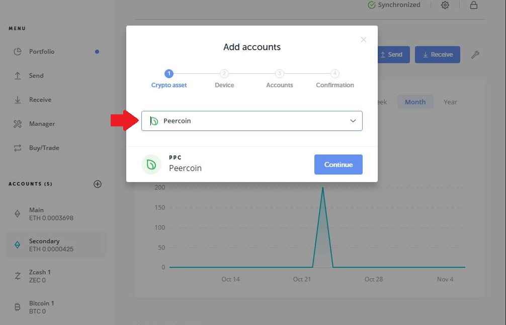

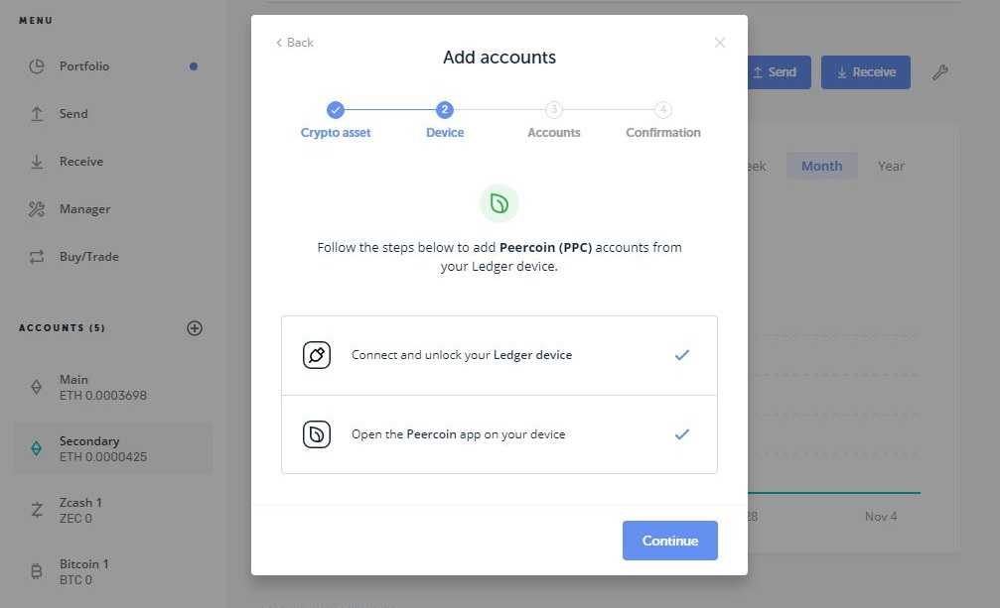

Click continue until everything is finalized and completed.  You now have the Peercoin app, and the account added to your Ledger product and wallet.

## Peercoin Paper Wallet Guide

You can find the source code for this wallet here: https://github.com/peercoin/peercoin-address-generator/

If you are interested in generating a paper wallet for holding your Peercoin, this guide will walk you through the process.  First, navigate to this address: https://paperwallet.peercoin.net/

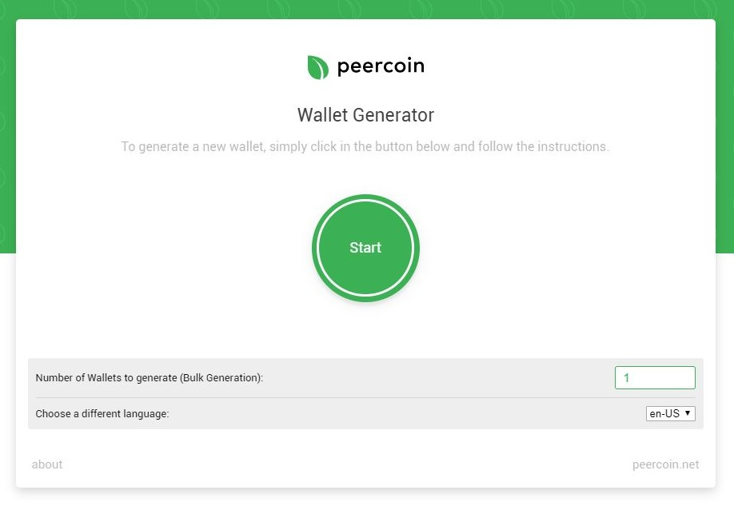

To being, click the large green Start button.  This will begin the wallet generation process.  In order to ensure randomness, you will be asked to move your mouse cursor around for a period until a wallet address is generated.  This movement of the mouse adds entropy to the generation of an truly random address

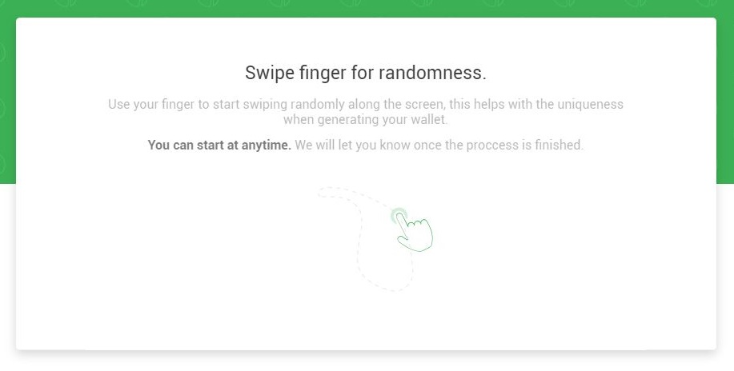

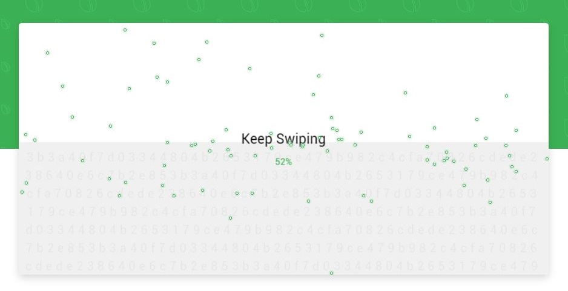

Once you have moved the mouse enough, the wallet will be generated and you will be presented with the public and private key for the new wallet.

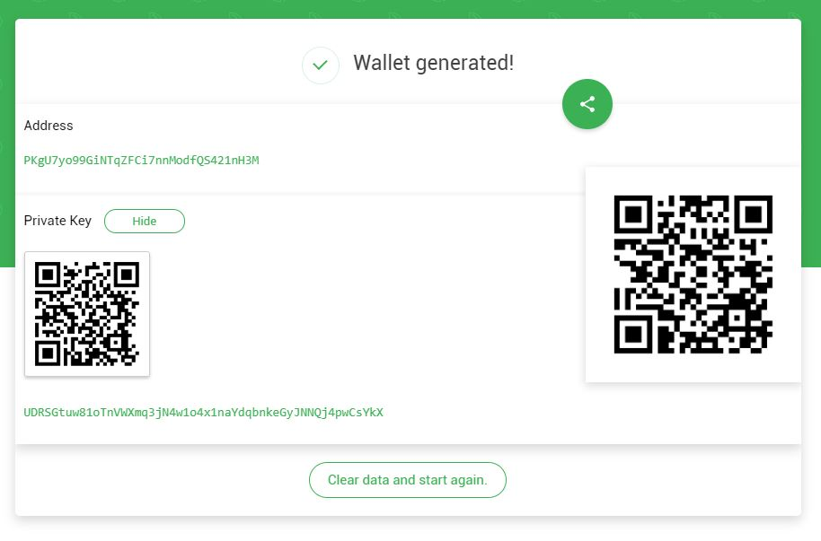

To export the wallet, click the green share icon on the left side of the QR code.  You will then be presented with the options displayed below.

*Save .txt locally
   *This option will download the wallet as a text file.*
*Copy address/priv. key to clipboard
   *This option will copy the address/priv. key to a clipboard where it can be pasted.  Make sure your system is clean and secure before exposing this information to potential threats like keystroke loggers.*
*Send via email
   *This option will allow you to send the wallet information via email.*
*Save JSON data will
   *This option will download the wallet information in JSON format.*
*Paper Wallet (print)
   *This option will open a print dialogue from which the wallet can be printed or saved as a PDF.  Paper wallets provide physical security and backups for Peercoins that are to be left in cold storage.*

This concludes the tutorial on the paper wallet generator.  This platform provides extra security for those who wish to keep their Peercoin in a safe and physical location.

#  Unofficial client implementations

## Coinomi

https://www.coinomi.com/

## Coinspot

https://www.coinspot.com.au

## CoinVault

https://www.coinvault.io/

## Cryptonator

https://www.cryptonator.com/

## HolyTransaction

https://holytransaction.com/

## Ledger

https://www.ledger.com/

## Magnum

Airdrop focused wallet

https://magnumwallet.co

## UberPay

http://uberpay.io/

---
